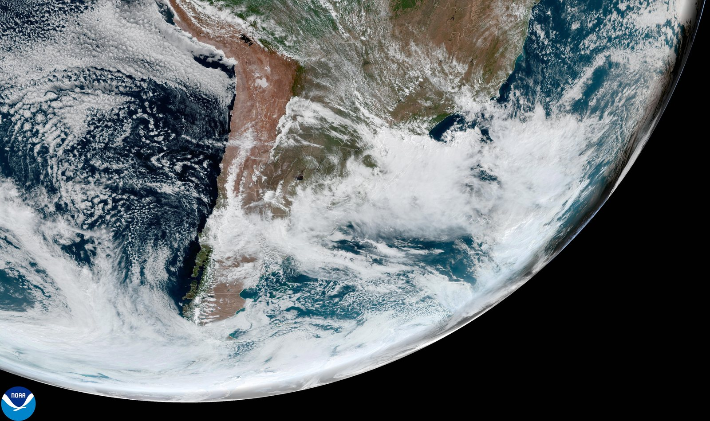
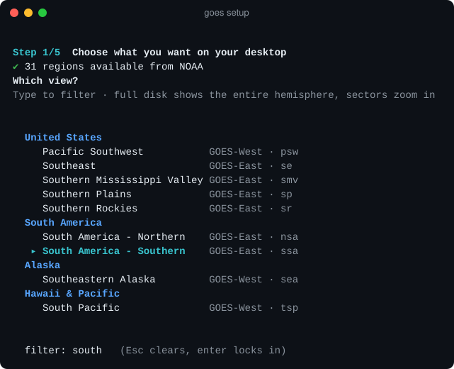
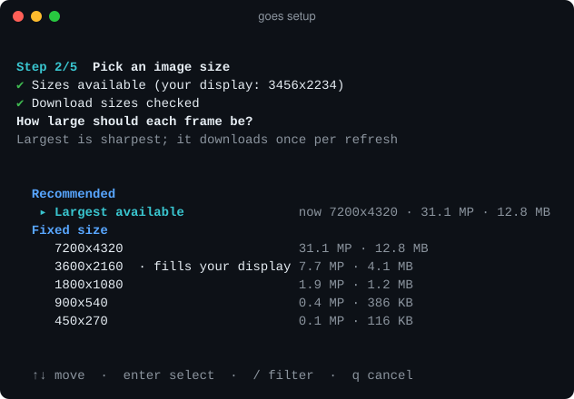
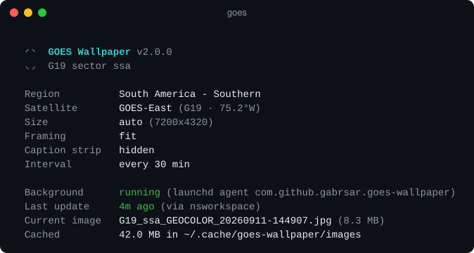
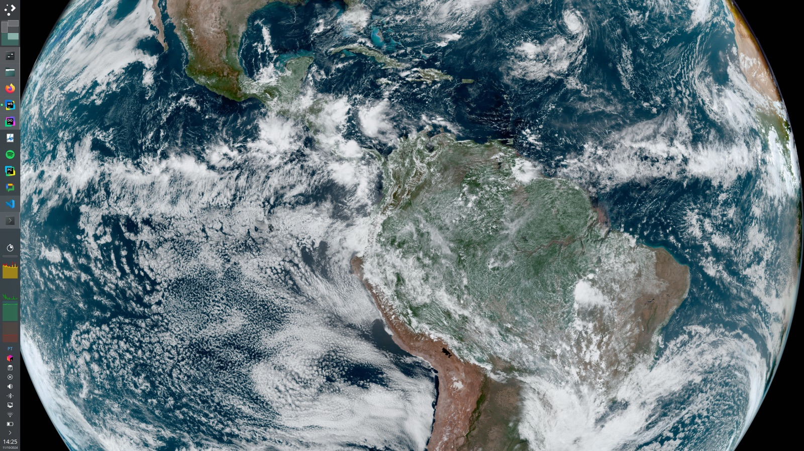
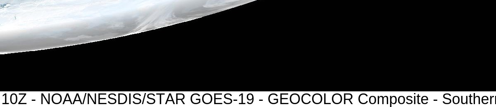
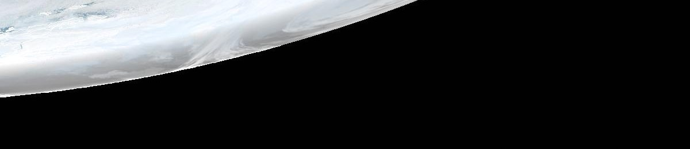

<div align="center">

# GOES Wallpaper

**Your desktop, live from 36,000 km up.**

Real-time imagery from NOAA's geostationary weather satellites, refreshed on your
desktop every few minutes. macOS and Linux. One command to install, no `sudo`.

[](https://github.com/gabrsar/goes-wallpaper/actions/workflows/test.yml)


[](LICENSE)

[Install](#install) · [Setup](#setup) · [Usage](#usage) · [Settings](#settings) · [Data usage](#data-usage) · [Troubleshooting](#troubleshooting) · [FAQ](#faq)

</div>



<p align="center"><sub>A frame exactly as <code>goes</code> set it: GOES-East over southern South America, 7200×4276, NOAA caption strip removed.</sub></p>

## Install

```bash
curl -fsSL https://raw.githubusercontent.com/gabrsar/goes-wallpaper/master/install.sh | bash
```

The installer:

- clones this repository over HTTPS into `~/.local/share/goes-wallpaper`
- links the `goes` command into `~/.local/bin` and adds that to your `PATH` if needed
- opens the setup wizard, which starts the background updates when you're done

It writes nothing outside your home directory and never asks for a password.
Running the command again upgrades in place and keeps your settings.

**Requirements:** macOS 11+ or Linux, with `curl` and `git`. On macOS both come
with the Xcode command line tools (`xcode-select --install`). On Linux, also
install ImageMagick if you want NOAA's caption strip removed
(`sudo apt install imagemagick`).

<details>
<summary><b>Installer options</b></summary>

Set these before `bash` in the command above, e.g. `… | GOES_NO_SETUP=1 bash`.

| Variable | Effect | Default |
|---|---|---|
| `GOES_INSTALL_DIR` | Where the program is cloned | `~/.local/share/goes-wallpaper` |
| `GOES_BIN_DIR` | Where the `goes` command is linked | `~/.local/bin` |
| `GOES_REPO` | Repository to clone | this repository |
| `GOES_BRANCH` | Branch or tag to install | default branch |
| `GOES_NO_SETUP=1` | Install only; run `goes setup` later | off |
| `GOES_NO_PATH=1` | Never edit a shell startup file | off |

To install from a clone instead:

```bash
git clone https://github.com/gabrsar/goes-wallpaper.git
cd goes-wallpaper && ./install.sh
```

</details>

## Features

- **Whole Earth or a close-up.** Full-disk views from GOES-East and GOES-West,
  plus 31 regional sectors, from the Great Lakes to the South Pacific.
- **Always the sharpest image.** It uses the largest frame NOAA publishes for
  your view, and picks up bigger ones if NOAA adds them.
- **No caption strip.** NOAA's white timestamp bar is detected and cropped off
  each frame. The picture underneath is untouched.
- **A setup wizard worth using.** Arrow keys, type-to-filter, regions grouped
  by area, and real download sizes shown before you commit.
- **Light on the network.** An unchanged frame is never downloaded twice.
- **Battery-aware.** It pauses on battery by default.
- **Proper background job.** A launchd agent on macOS, a systemd user timer on
  Linux. It runs at low priority, catches up after sleep and survives reboots.
- **Tells you what's wrong.** `goes doctor` checks every step and says how to
  fix whatever fails.

## Setup

The wizard runs during install. Run `goes setup` any time to change anything.

**1. Pick a view.** Start typing to filter. Whole-Earth views are at the top,
and regions are grouped by area.



**2. Pick a size.** The default is the largest frame. Every size is listed with
its real download cost, measured from NOAA on the spot.



**3–5.** Framing (fit, fill, center or stretch), whether to hide the caption
strip, how often to refresh, and whether to pause on battery. Enter accepts the
default at every step.

Keys: <kbd>↑</kbd> <kbd>↓</kbd> or <kbd>j</kbd> <kbd>k</kbd> to move,
<kbd>PgUp</kbd> <kbd>PgDn</kbd> <kbd>Home</kbd> <kbd>End</kbd> to jump,
type to filter, <kbd>Enter</kbd> to choose, <kbd>Esc</kbd> to clear the filter,
<kbd>q</kbd> to cancel.

## Usage

Run `goes` with no arguments to see what's going on:



| Command | What it does |
|---|---|
| `goes` | Show the configuration, background status and last update |
| `goes setup` | Choose region, size, framing and refresh rate |
| `goes update [--force]` | Fetch and apply the latest frame now (`--force` also runs on battery) |
| `goes start` / `goes stop` | Turn background updates on or off |
| `goes restart` | Reload the background schedule |
| `goes doctor [--no-test]` | Check everything, including a real download and wallpaper change |
| `goes config list` | Print every setting |
| `goes config set KEY VALUE` | Change one setting |
| `goes config edit` | Open the settings file in `$EDITOR` |
| `goes log [-f] [-n N]` | Show, or follow, the activity log |
| `goes open` | Open the current frame in an image viewer |
| `goes uninstall [--purge]` | Remove the tool (see [Uninstall](#uninstall)) |
| `goes version` / `goes help` | Version and install location, or help |

Changing a setting doesn't need the wizard:

```bash
goes config set sector pnw          # switch to the Pacific Northwest
goes config set view fd             # whole Earth instead of a region
goes config set scaling fill        # fill the screen, cropping the edges
goes config set interval 30         # refresh every half hour
goes config set trim_caption false  # keep NOAA's caption strip
```

## Settings

Stored in `~/.config/goes-wallpaper/config` as plain `key=value` lines:

| Key | Values | Default | Meaning |
|---|---|---|---|
| `view` | `fd`, `sector` | `sector` | `fd` is the full-disk hemisphere |
| `satellite` | `G19`, `G18` | set by setup | GOES-East, GOES-West |
| `sector` | region code, e.g. `ssa`, `pnw`, `hi` | set by setup | Ignored when `view=fd` |
| `resolution` | `auto` or `WIDTHxHEIGHT` | `auto` | `auto` is the largest available |
| `max_pixels` | whole number | `0` | Optional cap for `auto`; `0` means no cap |
| `scaling` | `fit`, `fill`, `center`, `stretch` | `fit` | How the frame sits on your screen |
| `trim_caption` | `true`, `false` | `true` | Crop NOAA's caption strip |
| `interval` | `1`–`1440` (minutes) | `10` | Time between refreshes |
| `on_battery` | `skip`, `run` | `skip` | Whether to update on battery |
| `keep_images` | `1`–`200` | `5` | Frames kept on disk; older ones are deleted |

The file is validated line by line and never executed, so a typo can't run
code. A bad value is reported and replaced with the default.

## Gallery

<table>
<tr>
<td width="50%"></td>
<td width="50%"></td>
</tr>
<tr>
<td align="center"><sub>Full disk, <b>Fit</b>: the whole planet on black</sub></td>
<td align="center"><sub>Full disk, <b>Fill</b>: cropped to fill the screen</sub></td>
</tr>
</table>

**Caption strip removal.** NOAA stamps a timestamp bar along the bottom of each
frame. `goes` detects it and crops it off, so the edge of the planet meets your
screen edge cleanly:

<table>
<tr><th>As published</th><th>As set by <code>goes</code></th></tr>
<tr>
<td></td>
<td></td>
</tr>
</table>

The strip is found by its shape, not a fixed height: it's 14 px at 450×270 and
44 px at 7200×4320. Anything that doesn't match, like bright clouds or black
space, is left alone. The NOAA logo can't be cropped because it sits on top of
the imagery. The two largest full-disk sizes have neither logo nor caption.

## Data usage

`goes` downloads each new frame once. Refreshing more often than NOAA
publishes costs nothing, because unchanged frames get a tiny "not modified"
reply. NOAA publishes full-disk and GOES-East regional frames every 10 minutes,
and GOES-West US regions every 5.

Approximate daily download at the default (largest) size:

| View | Per frame | Every 10 min | Every 30 min | Every hour |
|---|---:|---:|---:|---:|
| GOES-West US region (2400×2400) | ~3 MB | ~430 MB | ~145 MB | ~70 MB |
| GOES-East region (7200×4320) | ~13 MB | ~1.8 GB | ~610 MB | ~310 MB |
| Full disk (21696×21696) | ~54 MB | ~7.8 GB | ~2.6 GB | ~1.3 GB |
| Full disk, `max_pixels=32000000` (5424×5424) | ~17 MB | ~2.4 GB | ~820 MB | ~410 MB |

> [!TIP]
> On a metered connection, pick a smaller size in `goes setup`, raise the
> interval, or cap automatic sizing with `goes config set max_pixels 32000000`.
> That cap picks 5424×5424 for the full disk and keeps regional views at full
> size.

## Where things live

Everything follows the XDG base-directory layout:

| What | Where |
|---|---|
| Program | `~/.local/share/goes-wallpaper` |
| `goes` command | `~/.local/bin/goes` (a symlink) |
| Settings | `~/.config/goes-wallpaper/config` |
| Downloaded frames | `~/.cache/goes-wallpaper/images` |
| Log and last-run state | `~/.local/state/goes-wallpaper` |
| macOS background job | `~/Library/LaunchAgents/com.github.gabrsar.goes-wallpaper.plist` |
| Linux background job | `~/.config/systemd/user/goes-wallpaper.{service,timer}` |

The log is structured `key=value` lines, easy to grep:

```
ts=2026-09-11T14:49:08-0300 level=info event=fetch_ok key=G19_ssa_GEOCOLOR resolution=7200x4320 bytes=13358396
ts=2026-09-11T14:49:08-0300 level=info event=caption_trimmed rows=44 backend=swift
ts=2026-09-11T14:49:09-0300 level=info event=wallpaper_set backend=nsworkspace resolution=7200x4320
```

## Platform support

| Platform | How the wallpaper is set |
|---|---|
| **macOS** 11+ | `NSWorkspace` on every display, through a small Swift helper compiled once on first run. Falls back to AppleScript without the Xcode tools. |
| **GNOME**, Ubuntu, Pop!_OS | `gsettings`, including the dark-mode wallpaper key |
| **KDE Plasma** | `plasma-apply-wallpaperimage`, or the Plasma D-Bus API |
| **Xfce** | `xfconf-query`, for every monitor and workspace |
| **Cinnamon**, **MATE**, **Deepin** | `gsettings` |
| **LXQt**, **LXDE** | `pcmanfm-qt` / `pcmanfm` |
| **Sway**, **Hyprland**, other wlroots | `swaymsg`, `hyprctl`, or `swaybg` |
| Other X11 window managers | `feh` |
| Anything else | Your own command: `GOES_WALLPAPER_CMD="nitrogen --set-zoom-fill --save"` gets the image path appended |

The Linux timer runs outside your graphical session, so `goes` recovers the
display and D-Bus settings from your session at update time.

**Tested:** macOS end to end. On Linux, the install, downloads, caption
removal and the full test suite on Ubuntu 24.04. The Linux desktop setters use each
desktop's standard command, but not every desktop has been tried on a live
session. If yours misbehaves, `goes doctor` output in an issue helps.

<details>
<summary><b>Advanced environment variables</b></summary>

| Variable | Effect |
|---|---|
| `GOES_WALLPAPER_CMD` | Command that sets the wallpaper; the image path is appended |
| `GOES_CONFIG_HOME`, `GOES_CACHE_HOME`, `GOES_STATE_HOME` | Override the settings, cache and state folders (`XDG_*` is respected too) |
| `NO_COLOR` / `FORCE_COLOR` | Turn colored output off or force it on |
| `GOES_CDN_BASE`, `GOES_SITE_BASE` | Point at a NOAA mirror |
| `GOES_CONNECT_TIMEOUT`, `GOES_MAX_TIME`, `GOES_RETRIES` | Network timeouts (seconds) and retry count |

</details>

## Troubleshooting

Start with `goes doctor`. It checks your tools, settings, network, background
job, display and power, then does a real download and wallpaper change, with a
fix for anything that fails.

| Symptom | Cause | Fix |
|---|---|---|
| macOS: wallpaper doesn't change | The terminal lacks permission | System Settings › Privacy & Security › Automation: allow your terminal, then `goes update --force` |
| Linux: "Could not set the wallpaper" | Desktop not recognized | Install `feh`, or set `GOES_WALLPAPER_CMD` |
| Caption strip still visible (Linux) | ImageMagick missing | `sudo apt install imagemagick` (or your distro's package) |
| "On battery; skipping" | Working as intended | `goes config set on_battery run` |
| "NOAA has not published a new frame yet" | Normal between frames | Nothing to fix |
| `goes: command not found` | New `PATH` not loaded yet | Open a new terminal |
| Image looks soft | A small fixed size is set | `goes config set resolution auto` |

## FAQ

**How current is the picture?**
NOAA publishes a new frame every 10 minutes (every 5 for GOES-West US
regions), and `goes` checks as often as you tell it to. The default is every 10
minutes.

**Why is part of the Earth dark, with lights on it?**
That's the night side. NOAA's GeoColor product switches to an infrared cloud
view over a map of city lights where the sun is down.

**Which satellite should I pick?**
GOES-East (G19) covers the Americas and the Atlantic. GOES-West (G18) covers
western North America, Alaska, Hawaii and the Pacific. The wizard only offers
regions each satellite actually covers.

**Does it work with multiple monitors?**
On macOS every display gets the image. On Linux it depends on the desktop; most
of the setters above apply it to all monitors.

**Will it slow my computer down?**
Each refresh is one download plus a few seconds of work, at low CPU and disk
priority (a launchd background process, or a systemd service at `Nice=10` with
idle I/O). Then it exits; nothing stays running between refreshes.

**Can I remove the NOAA logo too?**
No. It's drawn on the imagery itself. The two largest full-disk sizes,
10848×10848 and 21696×21696, come without the logo or the caption.

## How it works

```
 launchd / systemd timer                             every N minutes
          │
          ▼
     goes update ──► on battery? ──yes──► skip (unless on_battery=run)
          │
          ▼
  cdn.star.nesdis.noaa.gov/GOES19/ABI/SECTOR/ssa/GEOCOLOR/7200x4320.jpg
          │   If-None-Match: <etag>                  304 → keep current frame
          ▼
  check it's a JPEG ─► crop caption strip ─► ~/.cache/goes-wallpaper/images
          │                                          (older frames pruned)
          ▼
  NSWorkspace (macOS) · gsettings / plasma / xfconf / swaybg / feh (Linux)
```

NOAA keeps a file named for each size (`7200x4320.jpg`) in every product
folder, and it always holds the newest frame, so no web scraping happens on
the update path. The list of regions does come from NOAA's site. It's cached
for a day, and a built-in copy is used when NOAA can't be reached.

## Uninstall

```bash
goes uninstall            # remove the background job, frames, logs and the command; keep settings
goes uninstall --purge    # also remove settings and the program itself
```

`--purge` only deletes the program folder if the installer created it. A copy
you cloned yourself is never touched. Your desktop keeps its current picture.

<details>
<summary><b>Upgrading from v1</b></summary>

Your old `~/.config/goes-*` settings are imported automatically the first time
you run `goes update`, `goes start` or `goes setup`. The old cron job or LaunchAgent is
removed, and the old files are kept in `~/.config/goes-wallpaper/legacy-v1/`.

</details>

## Development

```bash
tests/run.sh               # ~440 assertions, no network needed
tests/run.sh --network     # also downloads real frames from NOAA
tests/run.sh image         # a single test file
/bin/bash tests/run.sh     # on macOS: run everything on the system bash 3.2
```

Tests run in a sandbox, so they never change your wallpaper or touch your
background job. They cover:

- settings parsing, including malicious input
- the region catalog
- downloads and caption detection, with both backends checked against real NOAA frames
- the command line, installer, uninstall and background-job files
- the interactive picker, driven through a real pseudo-terminal
- a lint pass for bash 3.2 traps (macOS ships bash 3.2)

CI runs the suite and shellcheck on macOS and Ubuntu on every push and weekly,
so a change on NOAA's side shows up before users hit it.

```
bin/goes                CLI entry point and commands
lib/common.sh           paths, colors, structured logging
lib/config.sh           settings file and v1 migration
lib/catalog.sh          satellites, regions, NOAA discovery, size selection
lib/net.sh              curl with timeouts, retries and backoff
lib/fetch.sh            conditional download, validation, pruning
lib/image.sh            caption strip detection and cropping
lib/wallpaper.sh        macOS and Linux wallpaper setters
lib/service.sh          launchd agent and systemd timer
lib/swift.sh            builds and caches the macOS Swift helpers
lib/ui.sh               picker, prompts, spinner
lib/setup.sh            setup wizard
lib/doctor.sh           diagnostics
share/*.swift           macOS helpers: wallpaper setter, caption cropper
install.sh              one-command installer
tests/                  test suite, fixtures and pty driver
```

Contributions are welcome. Please run `tests/run.sh` (and `shellcheck` if you
have it) before opening a pull request, and keep scripts bash 3.2 compatible.

## Credits

Imagery: [NOAA / NESDIS / STAR](https://www.star.nesdis.noaa.gov/GOES/index.php),
from GOES-East (GOES-19) and GOES-West (GOES-18), GeoColor product. GOES
imagery is public-domain U.S. government data. This project is not affiliated
with NOAA.

## License

[MIT](LICENSE) © 2025 Gabriel Saraiva
