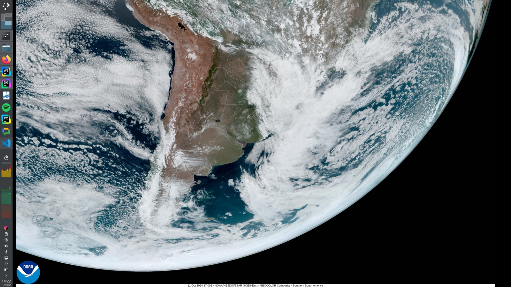
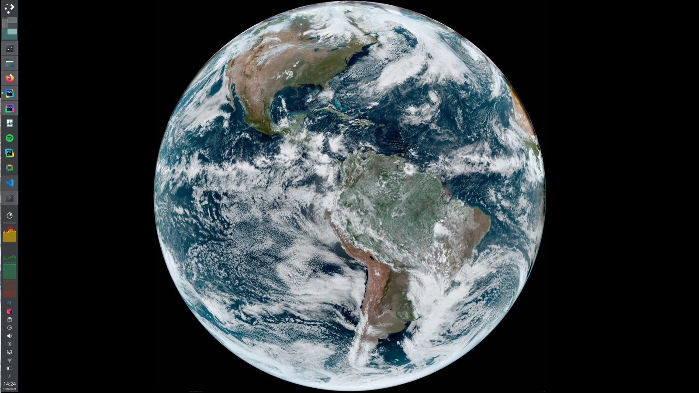

# GOES Wallpaper

**Your desktop, live from 36,000 km up.** Every ten minutes, NOAA's geostationary
weather satellites photograph the whole Western Hemisphere. This puts the latest
frame on your desktop, on macOS and Linux, with one command.



```bash
curl -fsSL https://raw.githubusercontent.com/gabrsar/goes-wallpaper/master/install.sh | bash
```

That's the whole install. It clones over HTTPS, needs no `sudo`, writes nothing
outside your home directory, and walks you through choosing a view.

---

## What you get

- **Whole Earth or a close-up.** Full-disk views from GOES-East and GOES-West,
  plus 31 regional sectors, from the Great Lakes to the South Pacific.
- **A picker that's actually pleasant.** Arrow keys, type-to-filter, regions
  grouped by area, and download sizes measured live from NOAA before you commit.
- **Sized for your screen.** It measures your display and recommends the
  smallest frame that's still sharp on it, so you're not pulling 50 MB every
  ten minutes for a laptop.
- **Light on the network.** Conditional requests mean an unchanged frame costs
  one tiny `304`, not a re-download.
- **Battery-aware.** It pauses on battery by default, and you can change that.
- **Runs in the background properly.** A `launchd` agent on macOS, a `systemd`
  user timer on Linux. It catches up after sleep and survives reboots.
- **Tells you what's wrong.** `goes doctor` checks every link in the chain and
  says how to fix whatever is broken.

## Choosing a view

`goes setup` runs during install, and you can run it again any time:

```
Step 1/5  Choose what you want on your desktop
✔ 31 regions available from NOAA

Which view?
Type to filter · full disk shows the entire hemisphere, sectors zoom in

  Full disk
   ▸ Whole Earth · GOES-East     G19 · 75.2°W
     Whole Earth · GOES-West     G18 · 137.0°W
  United States
     Great Lakes                 GOES-East · cgl
     Pacific Northwest           GOES-West · pnw
     ...
  South America
     South America - Northern    GOES-East · nsa
     South America - Southern    GOES-East · ssa

  ↑↓ move  ·  enter select  ·  / filter  ·  q cancel
```

```
How large should each frame be?

  Recommended
   ▸ Automatic                          now 5424x5424, adjusts itself
     5424x5424  ✔ best for your display 29.4 MP · 16.1 MB
  All sizes
     21696x21696                        470.7 MP · 51.3 MB
     1808x1808                          3.2 MP · 2.4 MB
     678x678                            0.4 MP · 438 KB
```

After that you pick framing (fit, fill, center, stretch), how often to refresh,
and what to do on battery. Every step accepts the default with Enter.

Keys: `↑`/`↓` or `j`/`k` to move, `PgUp`/`PgDn`, `Home`/`End`, start typing to
filter, `Enter` to choose, `Esc` to clear a filter, `q` to cancel.

## Everyday use

```bash
goes                     # what's configured, whether it's running, when it last ran
goes update --force      # grab the latest frame right now
goes setup               # change region, size or refresh rate
goes doctor              # check everything end to end
goes stop / goes start   # pause or resume background updates
goes log -f              # watch activity as it happens
goes open                # open the current frame in an image viewer
goes help                # everything else
```

Changing one setting doesn't need the wizard:

```bash
goes config set sector pnw        # switch to the Pacific Northwest
goes config set view fd           # whole Earth instead of a sector
goes config set interval 30       # refresh every half hour
goes config set on_battery run    # keep updating on battery
goes config edit                  # open the file in $EDITOR
```

## Settings

Stored in `~/.config/goes-wallpaper/config` as plain `key=value` lines.

| Key          | Values                             | Default    | Notes |
|--------------|------------------------------------|------------|-------|
| `view`       | `fd`, `sector`                     | `sector`   | `fd` is the full-disk hemisphere |
| `satellite`  | `G19`, `G18`                       | —          | GOES-East, GOES-West |
| `sector`     | region code, e.g. `ssa`, `pnw`     | —          | Ignored when `view=fd` |
| `resolution` | `auto` or `WIDTHxHEIGHT`           | `auto`     | |
| `max_pixels` | whole number                       | `30000000` | Upper limit used by `auto` |
| `scaling`    | `fit`, `fill`, `center`, `stretch` | `fit`      | `fit` shows the whole frame on black |
| `interval`   | `1`–`1440` minutes                 | `10`       | NOAA publishes about every 10 min |
| `on_battery` | `skip`, `run`                      | `skip`     | |
| `keep_images`| `1`–`200`                          | `5`        | Older frames are deleted |

The file is parsed and validated line by line and never `source`d, so a typo
can't run code. A bad value is reported and replaced with the default.

## Where things live

Everything follows the XDG base-directory layout:

| What                 | Where |
|----------------------|-------|
| Program              | `~/.local/share/goes-wallpaper` |
| `goes` command       | `~/.local/bin/goes` (symlink) |
| Settings             | `~/.config/goes-wallpaper/config` |
| Downloaded frames    | `~/.cache/goes-wallpaper/images` |
| Log and run state    | `~/.local/state/goes-wallpaper` |
| macOS scheduler      | `~/Library/LaunchAgents/com.github.gabrsar.goes-wallpaper.plist` |
| Linux scheduler      | `~/.config/systemd/user/goes-wallpaper.{service,timer}` |

The log uses structured `key=value` lines, which makes it easy to grep:

```
ts=2026-09-11T11:56:11-0300 level=info event=fetch_ok key=G19_ssa_GEOCOLOR resolution=3600x2160 bytes=4243416
ts=2026-09-11T11:56:12-0300 level=info event=wallpaper_set backend=nsworkspace resolution=3600x2160 bytes=4243416
```

## Platform support

**macOS** 11+. The wallpaper is set on every display through `NSWorkspace`, via
a small Swift helper that is compiled once and cached. Without the Xcode command
line tools it falls back to AppleScript. The lock screen shows the desktop
picture on its own, so it needs no extra step.

**Linux** desktops: GNOME (including the dark-mode wallpaper key), KDE Plasma,
Xfce (every monitor and workspace), Cinnamon, MATE, Deepin, LXQt, LXDE, Sway,
Hyprland, and any X11 window manager through `feh`. The systemd timer runs
outside your graphical session, so the display and D-Bus environment are
recovered from your session at update time.

Runs on the system bash on both (3.2 on macOS). Needs only `curl` and `git`.

## Upgrading

Run the install command again. It updates the checkout in place and keeps your
settings.

**Coming from v1?** Your old `~/.config/goes-*` settings are imported
automatically, and the old cron job or LaunchAgent is removed the first time
you run `goes setup` or `goes start`. The old files are kept in
`~/.config/goes-wallpaper/legacy-v1/`.

## Uninstalling

```bash
goes uninstall
```

This removes the background schedule, the cached frames and logs, and the `goes`
command. Your settings and the source checkout stay unless you delete them:

```bash
rm -rf ~/.local/share/goes-wallpaper ~/.config/goes-wallpaper
```

## Troubleshooting

Start with `goes doctor`. It checks tools, config, network, the scheduler, your
display and power state, then does a real download and wallpaper change, and
gives the fix for anything that fails.

| Symptom | Likely cause | Fix |
|---------|--------------|-----|
| macOS: wallpaper doesn't change | Terminal lacks permission | System Settings › Privacy & Security › Automation: allow your terminal, then `goes update --force` |
| Linux: "Could not set the wallpaper" | Unrecognized desktop | `sudo apt install feh` (or your distro's equivalent) |
| "On battery; skipping" | Working as intended | `goes config set on_battery run` |
| "NOAA has not published a new frame yet" | Normal between frames | Nothing to fix |
| `goes: command not found` | New PATH not loaded | Open a new terminal |

## How it works

```
 launchd / systemd timer          every N minutes
          │
          ▼
     goes update ──► on AC power? ──no──► skip
          │ yes
          ▼
  cdn.star.nesdis.noaa.gov/GOES19/ABI/SECTOR/ssa/GEOCOLOR/3600x2160.jpg
          │  If-None-Match: <etag>        (304 → nothing to do)
          ▼
  validate JPEG ─► ~/.cache/goes-wallpaper/images ─► prune old frames
          │
          ▼
  NSWorkspace (macOS) · gsettings / plasma / xfconf / swaybg / feh (Linux)
```

NOAA keeps a file named after each resolution (`3600x2160.jpg`) in every
product directory, and it always points to the newest frame. No HTML scraping
happens on the update path. The region list does come from NOAA's site, but
it's cached for a day, and a built-in copy is used when NOAA can't be reached.

## Development

```bash
tests/run.sh               # ~330 unit assertions, no network
tests/run.sh --network     # also downloads real frames from NOAA
tests/run.sh config        # just one file
/bin/bash tests/run.sh     # on macOS: run the suite under bash 3.2
```

The suite also lints for the portability traps this project is prone to:
bash-4-only syntax, `local a=1 b=$a` (which breaks on bash 3.2), unbraced
variables next to Unicode glyphs, and GNU-only tool flags. If `shellcheck` is
installed it runs too. CI runs everything on macOS and Ubuntu.

```
bin/goes            CLI entry point and command dispatch
lib/common.sh       paths, colors, structured logging
lib/config.sh       validated config file, v1 migration
lib/catalog.sh      satellites, regions, NOAA discovery, resolution choice
lib/net.sh          curl with timeouts, retries and backoff
lib/fetch.sh        conditional download, JPEG validation, pruning
lib/wallpaper.sh    macOS and Linux wallpaper backends
lib/service.sh      launchd agent / systemd timer
lib/ui.sh           the picker, prompts, spinner
lib/setup.sh        the setup wizard
lib/doctor.sh       diagnostics
share/              Swift wallpaper helper for macOS
```

## Credits

Imagery: [NOAA / NESDIS / STAR](https://www.star.nesdis.noaa.gov/GOES/index.php),
GOES-East (GOES-19) and GOES-West (GOES-18), GeoColor product. GOES imagery is
public-domain U.S. government data.



