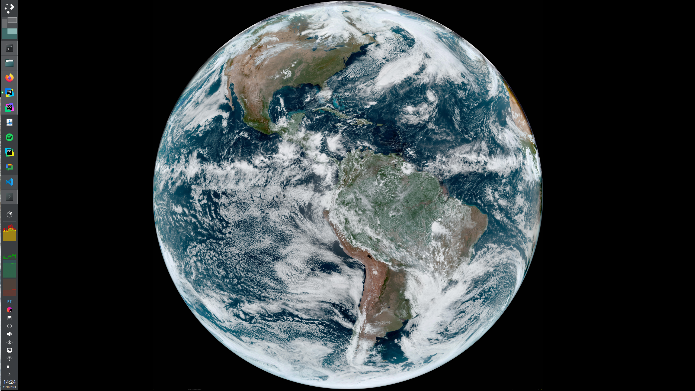

# Real Time Earth Wallpaper

Data from NOAA satelittes GOES-16 / GOES-18. Those satelites are in a synchronous orbit at 36.000 km away from Earth, so they keep stationary over same spot and send back data every 10 minutes.

## More information
https://www.star.nesdis.noaa.gov/GOES/fulldisk.php?sat=G16
https://www.star.nesdis.noaa.gov/GOES/index.php

## Examples

